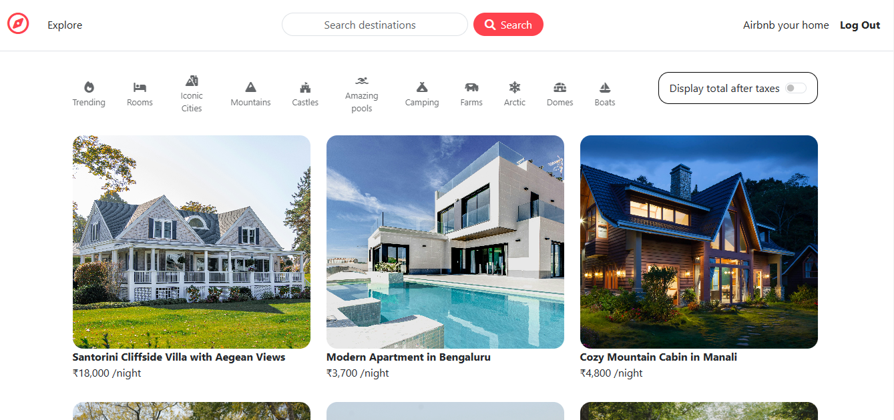
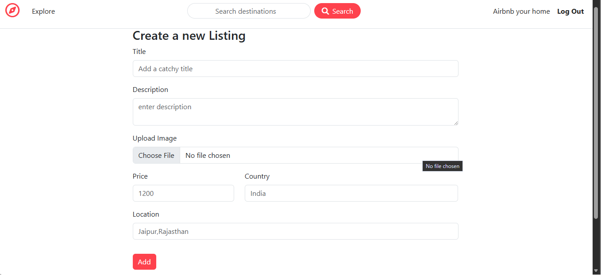
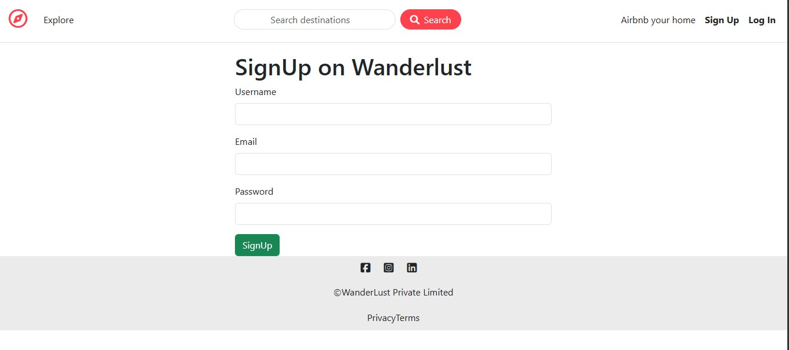
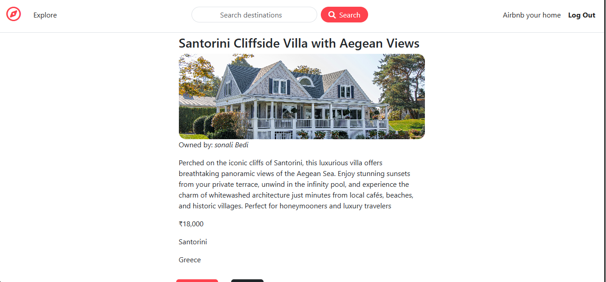
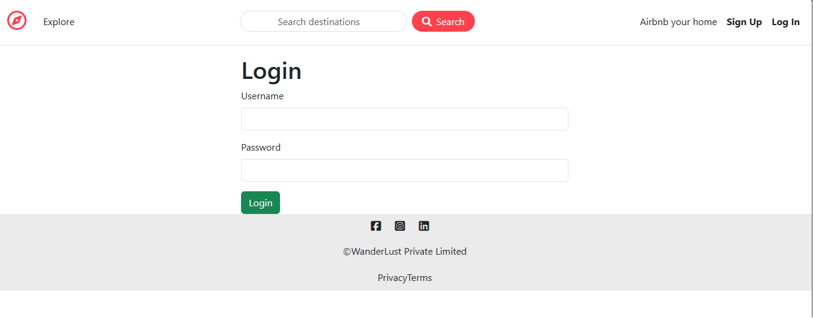

<div align="center">

# 🌍 WanderLust

### Discover • Share • Explore

A full-stack Airbnb-inspired property listing platform where users can discover unique stays, create listings, upload images, and share reviews.

<p>
  <a href="https://wanderlust-f4t9.onrender.com/listings"></a>
  <a href="https://github.com/tpal83957-byte/WanderLust"></a>
</p>

<p>


</p>

</div>

---

# 📖 About the Project

**WanderLust** is a full-stack web application inspired by Airbnb that enables users to browse travel destinations, create property listings, upload images, and share their experiences through reviews.

The application is built using the **MVC (Model-View-Controller)** architecture and demonstrates modern backend development concepts including secure authentication, authorization, RESTful routing, server-side validation, cloud image storage, and MongoDB integration.

This project was built to strengthen my understanding of full-stack web development using the Node.js ecosystem.

---

# 🚀 Live Demo

### 🌐 https://wanderlust-f4t9.onrender.com/listings

---

# ✨ Features

## 👤 User Authentication

- User Registration
- Secure Login & Logout
- Password Encryption
- Session-based Authentication
- Persistent Login Sessions

---

## 🏡 Property Listings

- Browse all listings
- View listing details
- Create new listings
- Edit existing listings
- Delete listings
- Upload listing images

---

## ⭐ Reviews

- Add reviews
- Delete own reviews
- Review validation

---

## 🔒 Authorization

- Only authenticated users can create listings.
- Only listing owners can edit/delete listings.
- Only logged-in users can post reviews.
- Only review authors can delete their reviews.

---

## ☁️ Image Upload

- Cloudinary Integration
- Multer Middleware
- Cloud-based image storage

---

## ✅ Validation

- Joi Validation
- Server-side validation
- Flash Messages
- Error Handling Middleware

---

# 🛠 Tech Stack

| Category | Technologies |
|----------|--------------|
| Frontend | HTML, CSS, Bootstrap, JavaScript, EJS |
| Backend | Node.js, Express.js |
| Database | MongoDB Atlas, Mongoose |
| Authentication | Passport.js, Passport Local, Passport Local Mongoose |
| Image Storage | Cloudinary, Multer |
| Validation | Joi |
| Sessions | Express Session, Connect-Mongo |
| Utilities | Connect Flash, Method Override, Dotenv |

---

# 🏗 MVC Architecture

```
Client
   │
   ▼
Express Routes
   │
   ▼
Controllers
   │
   ▼
Models
   │
   ▼
MongoDB Atlas
```

The application follows the **MVC Architecture**, making the code modular, maintainable, and scalable.

---

# 📂 Project Structure

```
WanderLust
│
├── assets/
├── controllers/
├── init/
├── models/
├── public/
├── routes/
├── uploads/
├── utils/
├── views/
│
├── app.js
├── middleware.js
├── cloudConfig.js
├── schema.js
├── package.json
└── README.md
```

---

# 📸 Screenshots

## 🏠 Home Page



---

## 🔐 Login



---

## 📝 Sign Up



---

## 📄 Listing Details



---

## ➕ Create New Listing



---

# ⚙️ Installation

### Clone the repository

```bash
git clone https://github.com/tpal83957-byte/WanderLust.git
```

### Navigate to the project directory

```bash
cd WanderLust
```

### Install dependencies

```bash
npm install
```

---

# 🔑 Environment Variables

Create a **.env** file in the project root and add:

```env
ATLASDB_URL=

SECRET=

CLOUD_NAME=

CLOUD_API_KEY=

CLOUD_API_SECRET=

MAP_TOKEN=
```

---

# ▶️ Run Locally

```bash
node app.js
```

Visit

```
http://localhost:8080
```

---

# 🔐 Security Features

- Secure Password Hashing
- Passport.js Authentication
- Authorization Middleware
- Session Management
- Joi Validation
- Cloudinary Secure Uploads
- Error Handling Middleware
- Flash Messages

---

# 📚 What I Learned

Working on WanderLust helped me gain practical experience with:

- Building RESTful Web Applications
- MVC Architecture
- Authentication & Authorization
- MongoDB Data Modeling
- Cloudinary Integration
- Multer File Uploads
- Express Middleware
- Server-side Validation
- Error Handling
- Session Management
- Full-stack Project Deployment

---

# 🚀 Future Enhancements

- ❤️ Wishlist Feature
- 🔍 Search & Filters
- 📍 Interactive Maps
- 💳 Online Booking & Payments
- 🌐 Google OAuth
- 👤 User Profiles
- 📱 Enhanced Mobile Responsiveness
- 📊 Admin Dashboard

---

# 🤝 Contributing

Contributions, suggestions, and improvements are always welcome.

Feel free to fork this repository and submit a Pull Request.

---

# 👩‍💻 Author

### Tanya Pal

- GitHub: https://github.com/tpal83957-byte
- LinkedIn: YOUR_LINKEDIN_PROFILE

---

<div align="center">

### ⭐ If you found this project helpful, consider giving it a star!

Thank you for visiting this repository.

</div>
